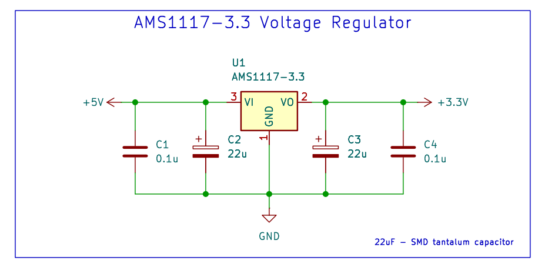
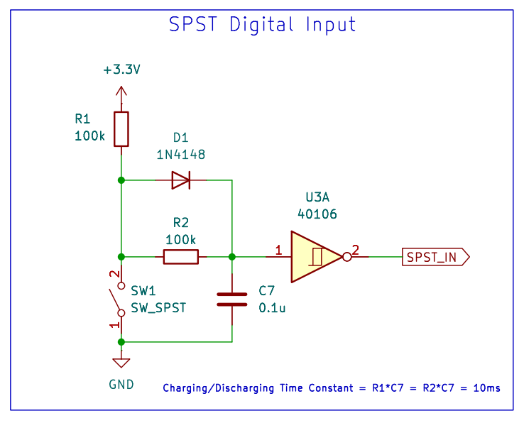
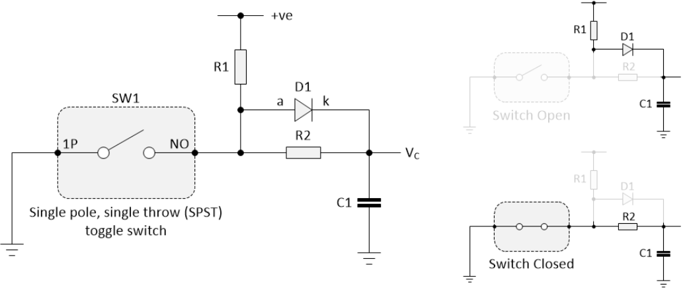
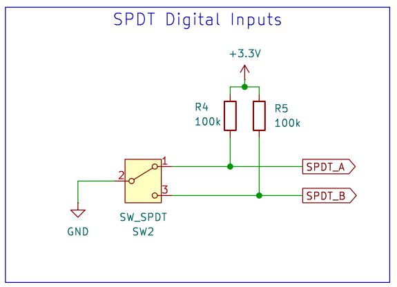
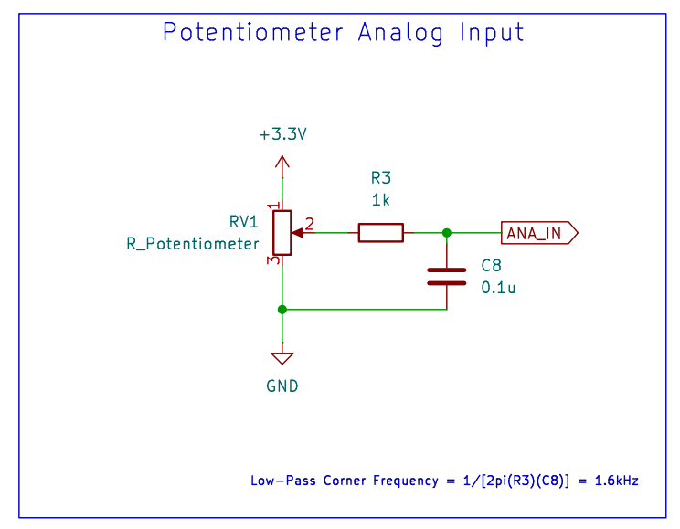
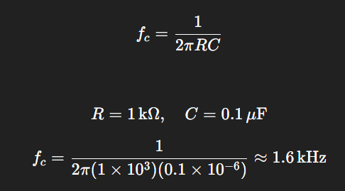
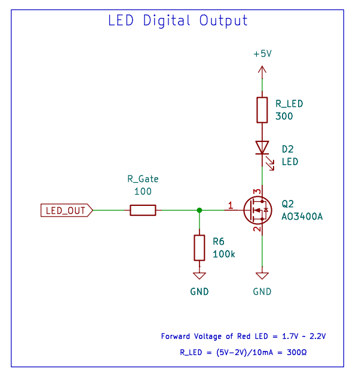
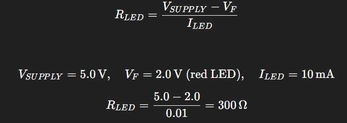

# MecatronProbation-LJC

## Probation Task Description 

### Goal
Create a schematic diagram for a PCB that will accept digital and analog inputs, output digital signals (LED).

### Instructions
- All digital input to be pulled to 3v3 via 100kOhm resistor
- Schematic diagram must be easy to read and understand. use of labels are expected.
- All calculations (if any) to be written clearly on the schematic diagram + separate document
- Diagram to be drawn via Kicad, submitted in PDF: plotted not printed

### Components
1. Single Digital Input (SPST Switch or Button): 2 Pins
2. Dual Digital Inputs (SPDT Switch): 3 Pins
3. Single Analog Input (Potentiometer): 3 Pins
4. Single Digital Output (LED): 2 Pins

### Extra Credits
1. Digital Inputs have debounce circuitry
2. Analog Inputs have filtering circuitry
3. All Inputs max voltage clamped to Vcc
4. Digital Outputs (LED) driven by Mosfets (via 5V), Mosfet gate-thr = 3v3
5. Digital `Mutually Exclusive` Inputs (SPDT switch) to output `(Signal, isValid)` 
6. Given 5V, get 3V3 via a buck convertor (AMS1117-3.3) on this board

## KiCad PCB Schematic Submission


The schematic is drawn in 6 sections: 
1. AMS1117-3.3 Voltage Regulator
2. ESP32 MCU
3. SPST Digital Input
4. SPDT Digital Inputs
5. Potentiometer Analog Input
6. LED Digital Output

### 1. AMS1117-3.3 Voltage Regulator

The **AMS1117-3.3** is a linear voltage regulator (LDO) used to step down the 5 V supply input to a stable 3.3 V rail for the power rails in the system.




The subcircuit consists of:

**U1 – AMS1117-3.3**: 5 V input regulated to 3.3 V output

**C1, C4 – 0.1 µF (ceramic)**: high-frequency decoupling capacitor at input and output for noise supression

**C2, C3 – 22 µF (tantalum)**: bulk capacitor at output for load stability (suggested by AMS1117 Datasheet)

These capacitors should be placed as close as possible to the AMS1117 pins.


### 2. ESP32 MCU

Here the **ESP32-S3-WROOM-1** is used as the MCU that serves as the central processing unit of the entire system.
It receives input signals from the SPST and SPDT switches and the analog potentiometer, processes these inputs, and outputs corresponding signal to drive the LED. 

The ESP32 operates at 3.3 V logic, making it fully compatible with all digital and analog circuitry on this board, which is powered by the AMS1117-3.3 regulator.


To ensure stable operation of the ESP32, a typical combination of **10 µF (C5)** and **0.1 µF (C4)** decoupling capacitors are placed close to the module’s 3.3 V power supply pin.

### 3. SPST Digital Input

This subcircuit allows a **single-pole single-throw (SPST) switch** to serve as a digital input for the ESP32.
The debouncing design ensures that the input voltage level and the signal are stable under mechanical switch bouncing.



**R1 – 100 kΩ pull-up resistor**: Pulls the input node to 3.3 V (HIGH) when the switch is open. This is to prevent floating pin and signal. 

**R2 – 100 kΩ debouncing resistor**: Use a value same as R1 to achieve equal charging and discharging time constant when switch is open or closed. 

**U3A – 40106 Schmitt Trigger Inverter**: Provides signal conditioning and eliminates noise caused by contact bounce. 

**C7 – 0.1 µF capacitor**: Forms a small RC debounce filter with the 100 kΩ resistor.

**D1 – 1N4148**: Restrict the capacitor C7 to discharge only to R2 instead of both R1 and R2 when the switch is open. This is to achieve equal charging and discharging time constant. 

When the switch is open, the pull-up resistor keeps the input HIGH (3.3 V).

When the switch is pressed, the node is pulled LOW (0 V).


Choosing C7 = 0.1µF and R1, R2 = 100 kΩ to achieve debouncing time constant of 10ms according to the formula of `τ = RC`, which is acceptable for typical mechanical switch.


**Charging and discharging of RC Debounce Circuit:**



<br>
There are several other methods for debouncing a switch, ranging from software debouncing, hardware debouncing and RC debouncing. Specifically, RC deboucning is used in this project due to the simplicity of application. 

> References of Debouncing Mechanism:
>
> [Texas Instrument Youtube Video - Debounce a Switch](https://www.youtube.com/watch?v=e1-kc04jSE4&t=39s)
>
> [Texas Instrument Article - Debounce a Switch](https://www.ti.com/lit/ab/scea094/scea094.pdf?ts=1759612546664)
> 
> [Electrosome Article - Switch Debouncing](https://electrosome.com/switch-debouncing/)
>
> [ELETimes Article - Implement Hardware Debounce for Switches](https://www.eletimes.ai/how-to-implement-hardware-debounce-for-switches-and-relays-when-software-debounce-isnt-appropriate)
>
> [Maya Programming - Designing an RC Debounce Circuit](https://mayaposch.wordpress.com/2018/06/26/designing-an-rc-debounce-circuit/)
>


### 4. SPDT Digital Inputs

The subcircuit convert each position of **Single-Pole Double-Throw (SPDT)** to one active LOW signal while the other remains HIGH.



There are several methods for debouncing a SPDT switch, specifically using SR Flip-Flop or D Flip-Flop. However, the debouncing techniques are not implemented here. 

> References of Debouncing Mechanism:
> 
> [EEJournal - Ultimate Guide to Switch Debounce (Part 5)](https://www.eejournal.com/article/ultimate-guide-to-switch-debounce-part-5/)
> 
> [EDN Article - SPDT Switch Debouncing With an SR Latch](https://www.edn.com/spdt-switch-debouncing-with-an-sr-latch/)


### 5. Potentiometer Analog Input

This subcircuit allows the system to read an analog voltage from a wiper pin of the potentiometer. The voltage from the potentiometer is fed into one of the ESP32’s ADC pins to measure an analog value between 0 V and 3.3 V.



A small RC low-pass on the ADC input to remove noise/aliasing from the potentiometer wiper.

**Low-Pass Filter Design with Cutoff Frequency**


This combination of **1kΩ (R3)** and **0.1µF (C8)** is typical RC combination used in low-pass filter. This cutoff frequency is able to filter out noise and small voltage spikes. 

### 6. LED Digital Output

The **LED Digital Output** subcircuit allows the ESP32 (3.3 V logic) to control an LED powered by a 5 V supply, using an N-channel MOSFET (AO3400A) as a low-side driver. 

An NMOS is used as a low-side driver because it can be fully turned on with a 3.3 V gate signal from the ESP32, providing low on-resistance. A PMOS would require a gate voltage higher than the 5 V supply to switch on in this configuration, making it unsuitable for direct control by 3.3 V logic.

**Why NMOS AO3400A is suitable?**


Based on AO3400A Datasheet, the typical value of gate threshold voltage VGS(th) is 1.05V, which is much lower than 3.3 V logic level provided by the ESP32. 

This means that when the ESP32 drives the gate to 3.3 V, the MOSFET is well above its threshold voltage and therefore operates fully in the saturation (fully ON) region rather than the cutoff region or linear transition region.

In this state, the device exhibits a very low on-resistance RDS(on). 



**Q2 – AO3400A (N-MOSFET)**: Acts as a low-side switch for the LED. 

**D2 – LED**: Typical Red LED with forward voltage of 1.7V ~ 2.2V. 

**R_LED – 300 Ω resistor**: Limits current through the LED.

**R_Gate – 100 Ω resistor**: Series resistor between ESP32 output and MOSFET gate. 

**R6 – 100 kΩ resistor**: Pull-down resistor to keep the gate LOW (off) when the MCU is unpowered. 

When the ESP32 drives the LED_OUT pin HIGH (3.3 V), the MOSFET gate voltage rises to 3.3 V, NMOS turns ON. 
Current flows from +5 V to the LED and MOSFET to GND. LED turns ON.

When the ESP32 output goes LOW (0 V), the MOSFET gate voltage is lower than the gate threhold voltage, NMOS turns OFF. The gate pulldown ensures it stays off. LED turns OFF.


**R_LED Calculation**

Typical Red LED has a forward voltage of 1.7V ~ 2.2V and forward current of 10mA to 20mA. Here, consider 2V and 10mA. 



**R_Gate Calculation**

The gate resistor (R_Gate) is between MCU output pin and the MOSFET’s gate. It has 3 main purposes:
1. Limit instantaneous current when charging/discharging the gate capacitance (protects MCU pin).
2. Damp oscillations or ringing (Gate + Wiring = small LC circuit).
3. Control switching speed


`Switching RC time constant = R_Gate * C_iss`


Switching edge is in nanoseconds scale which is very fast for LED control. Choosing resistance >1kΩ will increase the switching time constant to microseconds scale which is slow. 


When switching on NMOS, the MCU pin will source current pulse. It can be verified that I_peak = 33mA is within safe transient range of MCU pins. 


This verifies that R_Gate = 100 Ω is the reasonable value to use. 


```python

```
